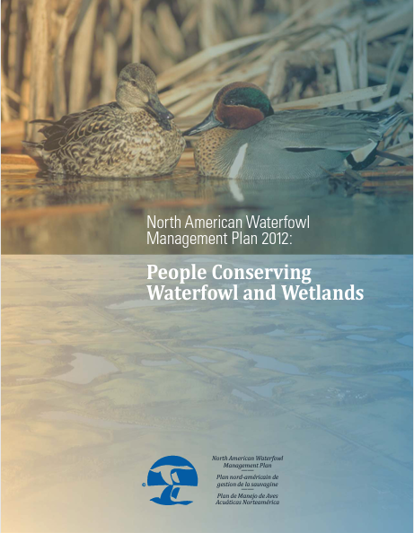
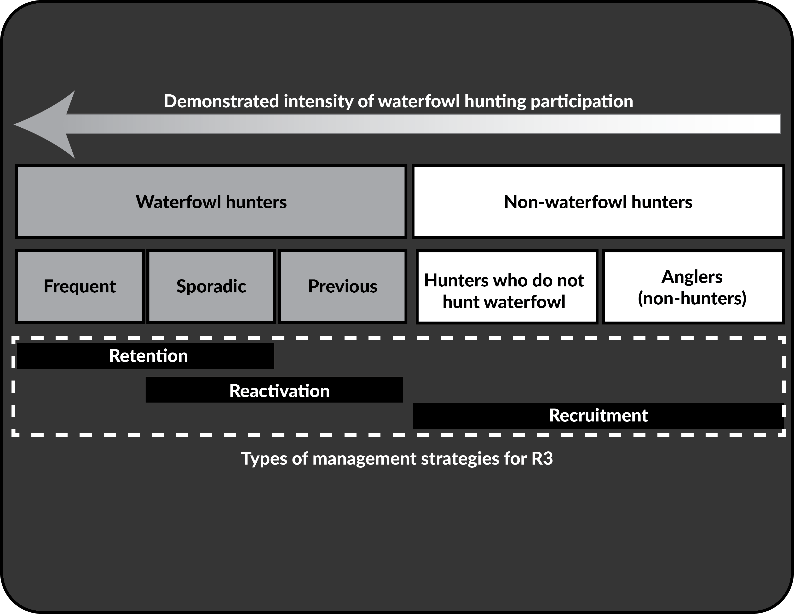
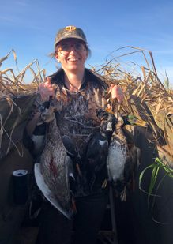

```{r setup, include=FALSE}

options(htmltools.dir.version = FALSE)
knitr::opts_chunk$set(
  fig.width=14, 
  fig.height=7, 
  fig.retina=3,
  out.width = "100%",
  cache = FALSE,
  echo = FALSE,
  message = FALSE, 
  warning = FALSE,
  hiline = TRUE
)

library(tidyverse)
library(ggtext)
library(flipbookr)
library(xaringanthemer)


```

```{r xaringan-themer, include=FALSE, warning=FALSE}

style_duo(
  primary_color = "#353535",
  secondary_color = "#ffffff",
  header_font_google = google_font("Martel"),
  header_color = "#d9d9d9",
  text_font_google = google_font("Lato"),
  code_font_google = google_font("Fira Mono"),
  base_font_size = "24px",
  colors = c(
    green = "#31b09e",
    "green-dark" = "#2c8475",
    grey = "#d3d3d380",
    highlight = "#87f9bb",
    purple = "#887ba3",
    pink = "#B56B6F",
    orange = "#f79334",
    red = "#dc322f",
    black = "#000000",
    `blue-dark` = "#002b36",
    `text-dark` = "#202020",
    `text-darkish` = "#42424",
    `text-mild` = "#606060",
    `text-light` = "#9a9a9a",
    `text-lightest` = "#eaeaea")
  )

xaringanExtra::use_xaringan_extra(c("tile_view",  "tachyons"))
xaringanExtra::use_extra_styles()

theme_set(theme_xaringan())

theme_update(panel.grid = element_blank(),
        axis.line = element_line(color = "#d9d9d9", size =1),
        axis.ticks = element_line(color = "#d9d9d9", size =1),
        axis.text = element_text(color = "#d9d9d9", size = 20),
        plot.margin = margin(1,1,1,1, "cm"),
        plot.caption = element_markdown(lineheight = 1.2, size = 10))

```

background-image: url('img/Collaborators.png')
background-size: 80%
background-position: 50% 80%

## Collaborations
---

## Hunters and wildife management

```{r fundingsources}
cons_fund <- read_csv("data/conservation_funding.csv") %>% 
  mutate(Amount = as.numeric(gsub("%","",Amount)),
         color = case_when(Level == "State agency" ~ "#8ECAE6",
                           Level == "Federal" ~"#FFB703",
                           Level == "State-level" ~ "#219EBC",
                           Level == "Other" ~ "#FB8500"),
         Source2 = glue::glue("<span style='color:{color}'>{Source}</span>"),
         Source2 = factor(Source2),
         Source2 = fct_reorder(Source2, Amount),
         Source2 = fct_relevel(Source2, "<span style='color:#FB8500'>Other</span>", after = 0))

ggplot(data = cons_fund) +
  geom_col(aes(x = Source2, y = Amount), fill = "#EF233C") +
  coord_flip(xlim = c(0.5,14.5), ylim = c(0,50), expand = FALSE) +
  labs(x = "Funding source", 
       y = "Percentage",
       caption = "<br>**Source**:AWFWA & AZGFD. 2017. The State Conservation Machine") +
  theme(axis.text.y = element_markdown(size = 18, hjust = 1))

```


---
background-image: url('img/fedDuckStamp.png')
background-size: 80%
background-position: 50% 80%

## Waterfowl hunters fund even more


---

```{r bpopandStamps}
duckBpop <- read_csv("data/totalBpop.csv", col_types =c("n","n","n")) 

duckstamps <- read_csv("data/Stamp-Sales-Over-the-Years.csv") 

full_join(duckBpop, duckstamps, by = c("Year" = "Season")) %>% 
  arrange(Year) %>% 
  rename(duckStamps = `Stamps Sold`) %>% 
  mutate(duckStamps = duckStamps/1000) %>% 
  select(Year,Bpop,duckStamps) %>% 
  rename(`Breeding pop` = Bpop,
         `US Duck Stamps` = duckStamps) %>% 
  filter(Year >= 1955 & Year <= 2010) ->  stamps_hunters


stamps_hunters %>% 
  pivot_longer(-Year, names_to = "measure", values_to = "value") -> stamps_hunters_long


blank_data <- data.frame(Year = c(1955,1955,2010,2010), 
                         measure = c("Breeding pop", "US Duck Stamps", "Breeding pop", "US Duck Stamps"),
                         value = c(50000,3000,15000,1000))
```


```{r bpopandStampsgraph, include = FALSE, echo = FALSE}
ggplot() +
  geom_line(data = stamps_hunters_long %>%  filter(Year <= 1993), aes(x = Year, y = value, color = measure), size = 1) +
  geom_point(data = stamps_hunters_long %>%  filter(Year <= 1993), aes(x = Year, y = value, color = measure), size = 3) +
  geom_blank(data = blank_data, aes(x = Year, y = value, color = measure)) +
  scale_y_continuous(labels = scales::comma)+
  scale_color_manual(values=c("Breeding pop" = "#8ECAE6", "US Duck Stamps" = "#219EBC")) +
  labs(y = "Value (x 1,000)", caption = ) +
  theme(legend.position = "none") +
  facet_wrap(~measure, ncol = 1, scales = "free") + #BREAK
  annotate("rect", xmin = 1993.5, xmax = 2010, ymin = -Inf, ymax = Inf, fill = NA, color = "yellow") +
    geom_line(data = stamps_hunters_long %>%  filter(Year >= 1993), aes(x = Year, y = value, color = measure), size = 1) +
  geom_point(data = stamps_hunters_long %>%  filter(Year >= 1993), aes(x = Year, y = value, color = measure), size = 3) 
  


```

`r chunk_reveal("bpopandStampsgraph", break_type = "user", display_type = "output", title = "## Hunters tracked with ducks")`

--
.footnote[**Loss** of $158 million (2022 US dollars); 42,500 to 80,900 fewer hectares<br>Vrtiska et al. (2013)]
---
## NAWMP

.pull-left[
> **Goal 1**: Abundant and resilient waterfowl populations to support hunting and other uses without imperiling habitat.

> **Goal 2**: Wetlands and related habitats sufficient to sustain waterfowl populations at desired levels, while providing places to recreate and ecological services that benefit society.

> .highlight[**Goal 3**: Growing numbers of waterfowl hunters, other conservationists, and citizens who enjoy and actively support waterfowl and wetlands conservation.]

]

.pull-right[

]
---
class: center, middle

###  There is a fundamental need to better understand the who, what, when, and why individuals do and do not participate in waterfowl hunting. 
<br>
###  Use this information to grow the number of people invested in waterfowl conservation. 

---
background-image: url('img/research-outline.png')
background-size: contain

---

## Modeling methods

.footnote[.highlight[More detail: [Graham, K. (2019)](https://digitalcommons.unl.edu/natresdiss/303/)] ]

.pull-left[
<br>
- Used a capture-recapture approach to model parameters using state duck stamp purchase histories
  - recruitment, retention, license purchase probability, and realized population growth rate
- Covariates:  state, generation, rurality code, hunting opportunity, Ducks Unlimited (DU) membership
  - Rurality and hunting location determined by zip code
  - DU membership matched to state license databases
- Used the Anvil cloud supercomputers running the RMark package
]
.pull-right[
 
]

---
## Modeling takeaways

- Age matters:  older individuals were more likely to retained and purchase on a regular basis, younger individuals are more likely to be recruited

- Rurality had a statistical influence but  effect size was minimal

- Hunting opportunity a statistical influence but effect size was also minimal

- Variation in parameters among states

- Strong influence of conservation organization membership
---
background-image: url('img/state_growth_plot.png')
background-size: 65%

## Modeling takeaways::state patterns

```{r getmapdata}
# states_of_int <- urbnmapr::get_urbn_map(map = "states", sf = TRUE) %>%
#   filter(state_abbv %in% c("MT", "MO", "SD", "KS", "NE"))
# 
# map_ratio <- tmaptools::get_asp_ratio(states_of_int)
# 
# labels_of_int <- urbnmapr::get_urbn_labels(map = "states", sf = TRUE) %>%
#   filter(state_abbv %in% c("MT", "MO", "SD", "KS", "NE"))

# states_of_int %>%
#   mutate(growth_rate = c(1.07,1.00,1.03,1.05, 1.07)) %>%
#   ggplot() +
#   geom_sf(aes(fill = growth_rate), color = "black") +
#   scale_fill_viridis_c(expression("\u03BB"), limits = c(1,1.08), option="plasma") +
#   geom_sf_text(data = labels_of_int,
#                 aes(label = state_name),
#                size = 6,
#                color = "black") +
#   theme_void() +
#   coord_sf() +
#   theme(legend.position = c(0.25,0.35),
#         legend.title = element_text(size = 22, hjust = 0.5, color = "#d9d9d9"),
#         legend.text = element_text(size = 20, color = "#d9d9d9"),
#         legend.key.size = unit(1, 'cm'),
#         plot.background = element_rect(fill = "#353535", color = "#353535"),
#         panel.background = element_rect(fill = "#353535", color = "#353535")) -> state_growth_plot
# 
# ggsave(here::here("2022-04-TTUSeminar/img","state_growth_plot.png"), width = map_ratio*5, height=5)
```

---
## Modeling takeaways::DU membership

```{r betacoeffs}
betaCoefs <- read_csv("data/graham_betas.csv") 

data_add <- data.frame(Parameter = c("Retention", "Retention", "Purchase", "Purchase"), Covariate = c("class 2", "class 8"), beta = c(0.33, 1.24, 0.50, 1.94))

data_add$p <- paste0("~",round(plogis(data_add$beta), 2))

ggplot(data = betaCoefs) +
  geom_errorbar(aes(x = Covariate, ymax = UCI, ymin = LCI), width = 0.15) +
  geom_point(aes(x = Covariate, y = beta, fill = Covariate), size = 4, shape = 21) + 
  geom_text(data = data_add, aes(x = Covariate, y = beta, label = p), position = position_nudge(x = 0.2), size = 8) +
  facet_wrap(~Parameter, ncol = 1) + 
  scale_x_discrete(labels = c("Greenwing", "Basic", "Volunteer", "Sponsor", "Sponsor &\nVolunteer", "Major\nsponsor")) +
  scale_fill_viridis_d(option = "inferno") +
  labs(y = "Beta coefficient", x = "DU membership class") +
  coord_cartesian(ylim = c(0, 3), xlim = c(0.5,6.5), expand = FALSE) + 
  theme(legend.position = "none")

```

.footnote[.highlight[No membership is the reference condition]
---

class: middle

###  Modeling tells a lot about patterns and ability to forecast trends in participation.<br><br>It tells us little about the underlying social mechanisms influencing those patterns. 
---
## Survey methods
.footnote[.highlight[More detail: [Hinrichs, M. (2019)](https://digitalcommons.unl.edu/natresdiss/282/)]; [Hinrichs et al. (2021)](https://www.tandfonline.com/doi/abs/10.1080/10871209.2020.1858208); [Hinrichs et al. (2021)](https://wildlife.onlinelibrary.wiley.com/doi/full/10.1002/wsb.1241); Hinrichs et al. *Accepted pending revision*]

.pull-left[
- Used a web-based questionnaire with an email invitation
- Sampled hunters and anglers in 8 states
- Used two waves of invitations during summer 
- Invitations sent to +88,000 individuals
  - 7,875 responded and agreed to participate
- Asked questions about motivations, constraints, and attitudes toward scenarios to increase waterfowl participation
]
.pull-right[
 
]

---
## Survey takeaways::motivations

.footnote[
.highlight[
More detail: [Hinrichs et al. (2021)](https://www.tandfonline.com/doi/abs/10.1080/10871209.2020.1858208)
]
]

```{r hinrichmotivation}
motivs <- read_csv("data/hinrich_motivation.csv") %>% 
  mutate(Motivation = factor(Motivation, levels = c("Nature", "Social", "Challenge", "Food")))

ggplot(data = motivs, aes(x = Motivation, y = Mean, ymax = Mean + SD, ymin = Mean - SD, group = Group)) + 
  geom_errorbar(position = position_dodge(width = 0.6), width = 0.4, alpha = 0.5, color = "white") +
  geom_point(aes(fill = Group), position = position_dodge(width = 0.6), size = 4, shape = 21, color = "white") + 
  coord_cartesian(xlim = c(0.5, 4.5), ylim = c(0.5,5.5), expand = FALSE)+ 
  scale_y_continuous(labels = c("Not at all", "Slightly", "Moderately", "Important","Very"), breaks = 1:5) +
  scale_fill_viridis_d(option = "turbo") +
  labs(y = "Importance") + 
  theme(legend.position = c(0.35,0.15),
        legend.title = element_blank(),
        legend.text = element_text(size = 14))


```

---
background-image: url('img/state_motivations.png')
background-size: 65%

## Survey takeaways::motivations

```{r}
# states_of_int <- urbnmapr::get_urbn_map(map = "states", sf = TRUE) %>%
#   filter(state_abbv %in% c("MT", "MO", "SD", "KS", "NE","OK","MI","WY"))
# 
# labels_of_int <- urbnmapr::get_urbn_labels(map = "states", sf = TRUE) %>%
#   filter(state_abbv %in% c("MT", "MO", "SD", "KS", "NE","OK","MI","WY"))
# 
# map_ratio <- tmaptools::get_asp_ratio(states_of_int)
# 
# ggplot(data = states_of_int) +
#   geom_sf(color = "white", fill = "#d9d9d9") +
#   geom_sf_text(data = labels_of_int,
#                 aes(label = state_name),
#                size = 4,
#                color = "black") +
#   coord_sf() +
#   labs(caption = "No *meaningful* spatial differences in motivations") +
#   theme_void() +
#   theme(plot.background = element_rect(fill = "#353535", color = "#353535"),
#         panel.background = element_rect(fill = "#353535", color = "#353535"),
#         plot.caption = element_markdown(size = 10, color = "white"))
# 
# ggsave(here::here("2022-04-TTUSeminar/img","state_motivations.png"), width = map_ratio*5, height=5)
```


.footnote[
.highlight[
More detail: [Hinrichs et al. (2021)](https://www.tandfonline.com/doi/abs/10.1080/10871209.2020.1858208)
]
]
---


```{r hinrichconstraints}
constraints <- read_csv("data/hinrich_constraint.csv") %>% 
  group_by(Constraint) %>% 
  mutate(meanC = mean(Mean)) %>% 
  ungroup() %>% 
  mutate(Constraint = case_when(Constraint == "Waterfowl Hunting Skills"~"Waterfowl\nSkills",
                                Constraint == "Land Access/Permissions"~"Land Access\nPermissions",
                                Constraint == "Other Hunters"~"Other\nHunters",
                                Constraint == "Waterfowl Populations"~"Waterfowl\nPopulations",
                                Constraint == "Views of Others"~"Views of\nOthers",
                                TRUE ~ Constraint),
         Constraint = as.factor(Constraint),
         Constraint = forcats::fct_reorder(Constraint,desc(meanC)),
         Group = case_when(Group == "Dissociated" ~ "Dissociated WF",
                           Group == "Frequent" ~ "Frequent WF",
                           Group == "Sporadic" ~ "Sporadic WF",
                           Group == "Hunter" ~ "Non-WF hunter",
                           TRUE ~ Group),
         Group = factor(Group, levels = c("Frequent WF", "Sporadic WF", "Dissociated WF", "Non-WF hunter", "Angler")))
```


```{r hinrichconstraints_plot, include = FALSE, echo = FALSE}
ggplot(data = constraints, aes(x = Constraint, y = Mean, ymax = Mean + SD, ymin = Mean - SD, group = Group)) + 
  geom_errorbar(position = position_dodge(width = 0.6), width = 0.4, alpha = 0.5, color = "white") +
  geom_point(aes(fill = Group), position = position_dodge(width = 0.6), size = 4, shape = 21, color = "white") + 
  coord_cartesian(xlim = c(0.5, 7.5), ylim = c(0,4), expand = FALSE)+ 
  scale_y_continuous(labels = c("Not at all", "Slightly", "Moderately", "Very","Extremely" )) + 
  scale_fill_viridis_d(guide = guide_legend(label.position = "bottom", override.aes = list(size = 10)))+ 
  labs(y = "Limiting") + 
  theme(legend.position = "bottom",
        legend.title = element_blank(),
        legend.text = element_text(size = 14),
        legend.key.size = unit(1, "mm")) + #BREAK
  annotate('rect', xmin = 0.65, xmax = 2.5, ymin = 0.1,  ymax = 3.9, fill = NA, color = "yellow") + #BREAK
  annotate('rect', xmin = 5.65, xmax = 6.5, ymin = 0.1,  ymax = 3.9, fill = NA, color = "yellow")


```


`r chunk_reveal("hinrichconstraints_plot", break_type = "user", display_type = "output", title = "## Survey takeaways::constraints")`


---
background-image: url('img/state_constraints.png')
background-size: 65%

## Survey takeaways::constraints

---
background-image: url('img/scenarios1.png')
background-size: 100%

## Survey takeaways::scenarios
---
background-image: url('img/scenarios2.png')
background-size: 100%

## Survey takeaways::scenarios

---
background-image: url('img/scenarios3.png')
background-size: 100%

## Survey takeaways::scenarios
---
## Experimental regulations::Two tier

- Nebraska and South Dakota implemented an experimental Two-tier system of harvest regulations
 - approved by the the U.S. Fish and Wildlife Service for the 2021/22 hunting season and extended through 4 hunting seasons

- Hunters select one of two different regulatory options when registering through the Harvest Information Program (HIP) for duck hunting 
  - Tier I have 6 duck limit with species and sex limits 
  - Tier II have a reduced bag limit of 3 ducks per day but no sex or species-specific restrictions

- Hunters remain in selected tier for the entire duck season 
- Checked by law enforcement on the hunter’s HIP identification card 

- The social and ecological effects are being evaluated
  - Parts collections for all Tier II
  - Several surveys
---
## Experimental regulations::Two tier
.pull-left[
### Objectives
1. Maintain or increase conservation support by increasing waterfowl hunting participation
2. Help assure the continuation of waterfowl hunting heritage
3. Maintain sustainable populations of all ducks
4. Increase funding for waterfowl management and conservation
5. Minimize monitoring and administrative costs of implementing, maintaining, and monitoring such a system]

.pull-right[

]

---
background-image: url('img/firstSeason.png')
background-size: 100%

## Two-tier::first-year takeaways
---
## Final points

- Individuals that participate in wildlife-based recreation do so for similar reasons

- No one "strong" reason why people are constrained in recreating
  - Likely the combination of a bunch of small things
  
- Waterfowl management is unique in the social-ecological approach to addressing this problem
  - "Experiments" may lead to new insights

- Addressing funding for conservation is an increasing worry.
  - Continued work will be required to address funding wildlife management and conservation
  - R3 will likely be only part of the solution
---
class: center, middle

This research was supported by several Federal Aid in Sport Fish and Wildlife Restoration projects, which were administered by the Nebraska Game and Parks Commission.

<br>
<br>
<br>
.red[cchizinski2@unl.edu] | .red[humandimensions.unl.edu]


